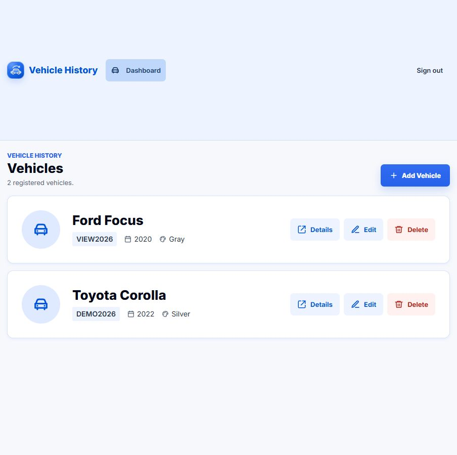
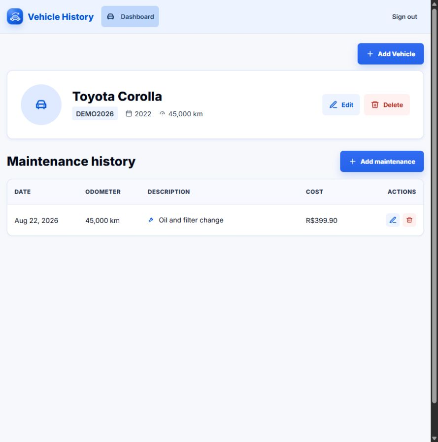

# Vehicle Maintenance History

[](https://github.com/mmetznerm/vehicle-maintenance-history/actions/workflows/ci-cd.yml)


REST API and frontend to manage vehicles and their maintenance history.

## Live Demo

[Open the live portfolio application](http://3.128.87.156/).

The demo is HTTP-only. Use fictitious data and a unique password created only
for this test; do not reuse personal or production credentials. Availability
depends on AWS Free Tier eligibility, remaining credits, and the EC2 instance's
dynamic public IPv4 address. See the current
[deployment acceptance record](docs/portfolio-acceptance.md) for the exact
release and checks verified.

## Screenshots





## Stack

- Java 21
- Spring Boot
- Spring Security
- Spring Data JPA
- PostgreSQL
- Flyway
- JWT
- Docker
- Testcontainers
- Swagger/OpenAPI
- Spring Actuator
- React
- TypeScript
- Vite

## Project Structure

```text
vehicle-maintenance-history/
  backend/     Spring Boot API and static frontend output.
  frontend/    React + TypeScript + Vite source code.
  docs/        Project documentation.
```

Backend package structure:

```text
com.mmetzner.vmh
  auth
  vehicle
  maintenance
  shared
```

Each backend feature is organized by:

```text
domain
application
infrastructure
presentation
```

## Features

- User registration and login
- JWT authentication
- Refresh token and logout
- Vehicle CRUD
- Maintenance CRUD by vehicle
- Standard error responses
- Database migrations with Flyway
- Unit and integration tests
- Basic observability with `X-Request-Id`

## Running Locally With Docker

```bash
docker compose up --build
```

Application:

```text
http://localhost:8080
```

Swagger:

```text
http://localhost:8080/swagger-ui.html
```

Health:

```text
http://localhost:8080/actuator/health
```

## Docker Hub

Successful pushes to `main` publish the application image to Docker Hub after
all CI checks pass. This delivery step does not deploy the application to a
server.

Pull the latest successful build:

```bash
docker pull mmetznerm/vehicle-maintenance-history:latest
```

Published tags:

- `latest` points to the newest successful build from `main`.
- `sha-<commit>` identifies the exact source commit used for the image.

## AWS Deployment

The [AWS deployment guide](docs/aws-deployment.md) describes the console setup,
the first bootstrap and day-to-day operations. A pull request runs CI without
deploying. After it is merged to `main`, GitHub Actions publishes the same
SHA-tagged image to Docker Hub and Amazon ECR, then deploys it through Systems
Manager.

```text
Pull Request -> main -> GitHub Actions -> Docker Hub + ECR -> SSM -> EC2 -> private RDS
```

Docker Hub demonstrates public image delivery. Private ECR is the runtime image
source for EC2. GitHub OIDC uses separate publishing and deployment roles, so
the repository keeps no persistent AWS access keys. SSM replaces SSH, ECR SHA
tags are immutable, the EC2 root EBS volume is encrypted, and RDS is private
behind a security-group-to-security-group PostgreSQL rule. The application uses
the limited `vmh_app` database role; the temporary master bootstrap parameter
was removed after connectivity was proven.

The [production acceptance record](docs/portfolio-acceptance.md) documents the
verified SHA deployment, private RDS connectivity, login and refresh probes,
vehicle and maintenance CRUD, and persistence after a container restart.

Current trade-offs are deliberate: one EC2 instance, Single-AZ RDS, HTTP,
dynamic IPv4, fictitious test data, manual rollback, and availability that
depends on Free Tier eligibility and promotional credits.

## Recommended Local Development Workflow

For day-to-day development, prefer running only PostgreSQL in Docker and running
the Spring Boot application locally from the IDE. This keeps Java debugging,
breakpoints, hot reload and logs easier to use.

Start only the database:

```bash
docker compose up -d postgres
```

Build the frontend into Spring Boot static resources:

```bash
cd frontend
npm.cmd run build
```

Then start `VmhApplication` from the IDE. The full application is available from
a single origin:

```text
http://localhost:8080
```

Useful frontend routes:

```text
http://localhost:8080/login
http://localhost:8080/register
```

In IntelliJ IDEA, make the green Start button build the frontend before starting
the backend:

```text
Run/Debug Configurations > VmhApplication > Modify options > Add before launch task
```

Add an npm task pointing to:

```text
package.json: frontend/package.json
script: build
```

After that, pressing Start on `VmhApplication` refreshes the frontend build and
starts the backend.

For fast frontend-only iteration, run:

```bash
cd frontend
npm.cmd run dev
```

The Vite dev server proxies `/v1` requests to `http://localhost:8080`.

## Running Tests

Unit and controller tests:

```bash
cd backend
.\mvnw.cmd test
```

Integration tests:

```bash
cd backend
.\mvnw.cmd verify -Pintegration-tests
```

Integration tests use Testcontainers, so Docker must be running.

## CI Quality Gates

Pull requests are checked with:

- Backend unit, controller and coverage checks with Maven and JaCoCo.
- Backend integration tests with Testcontainers and PostgreSQL.
- Frontend lint, Vitest coverage and production build.
- CodeQL security analysis, a direct publication gate.
- `deployment-contracts`, ShellCheck, actionlint and Compose rendering.

After these checks pass on a push to `main`, GitHub Actions builds the production
image and publishes it to Docker Hub and ECR with `latest` and `sha-<commit>`
tags. The publish job assumes the ECR-only OIDC role, while the deploy job
assumes the SSM-only OIDC role; ECR SHA tags are immutable.

## Authentication

Protected endpoints require:

```http
Authorization: Bearer <accessToken>
```

Basic flow:

```text
1. Register user
2. Receive accessToken and refreshToken
3. Use accessToken on protected endpoints
4. Use refreshToken to renew tokens
```

## Main Endpoints

### Auth

| Method | Endpoint | Description |
|---|---|---|
| POST | `/v1/auth/register` | Register user |
| POST | `/v1/auth/login` | Login |
| POST | `/v1/auth/refresh` | Refresh tokens |
| POST | `/v1/auth/logout` | Logout |

### Vehicles

| Method | Endpoint | Description |
|---|---|---|
| POST | `/v1/vehicles` | Create vehicle |
| GET | `/v1/vehicles` | List user vehicles |
| GET | `/v1/vehicles/{vehicleId}` | Find vehicle |
| PUT | `/v1/vehicles/{vehicleId}` | Update vehicle |
| DELETE | `/v1/vehicles/{vehicleId}` | Delete vehicle |

### Maintenances

| Method | Endpoint | Description |
|---|---|---|
| POST | `/v1/vehicles/{vehicleId}/maintenances` | Create maintenance |
| GET | `/v1/vehicles/{vehicleId}/maintenances` | List maintenances |
| GET | `/v1/vehicles/{vehicleId}/maintenances/{maintenanceId}` | Find maintenance |
| PUT | `/v1/vehicles/{vehicleId}/maintenances/{maintenanceId}` | Update maintenance |
| DELETE | `/v1/vehicles/{vehicleId}/maintenances/{maintenanceId}` | Delete maintenance |

## Configuration

Main backend configuration file:

```text
backend/src/main/resources/application.yml
```

Important environment variables:

```text
JWT_SECRET
SPRING_DATASOURCE_URL
SPRING_DATASOURCE_USERNAME
SPRING_DATASOURCE_PASSWORD
```

Default local database:

```text
database: vehicle-maintenance-history
username: vehicle-maintenance-history
password: vehicle-maintenance-history
```

## Database Migrations

Flyway migrations are located at:

```text
backend/src/main/resources/db/migration
```

## Observability

Every HTTP response includes:

```http
X-Request-Id
```

If the client sends this header, the API reuses it. Otherwise, the API generates
a new one.

## Roadmap and Deliberate Trade-offs

The [infrastructure roadmap](docs/portfolio-roadmap.md) defines explicit
triggers and cost questions for future changes. These are decisions to revisit,
not promised features:

- HTTPS and a stable domain when the demo needs a durable URL or anything beyond fictitious credentials.
- Observability and alerts when recurring traffic or an availability target requires centralized diagnostics.
- Automatic rollback when multiple accepted SHA releases exist and recovery time matters more than manual simplicity.
- Terraform when a second environment, recreation, or material console drift makes infrastructure as code useful.
- A possible ECS migration only when scaling, managed scheduling, multiple instances, or higher availability becomes necessary.

ECS is not automatically more current or more appropriate than one EC2
instance for this small, Free Tier-conscious portfolio workload.
